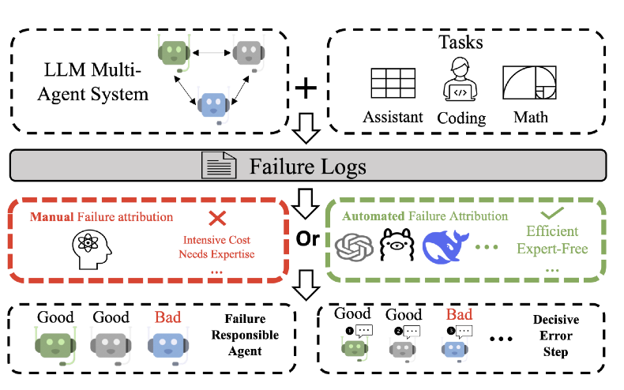
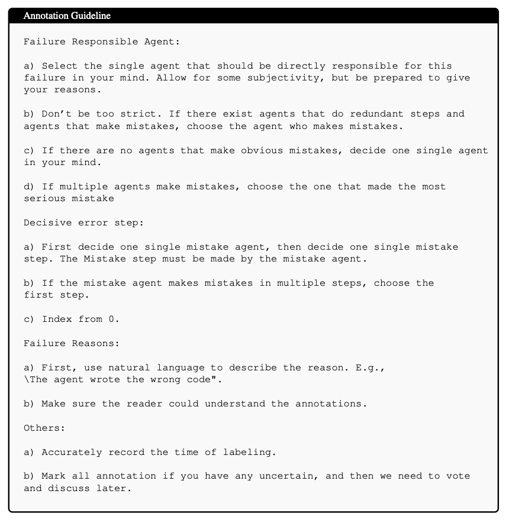
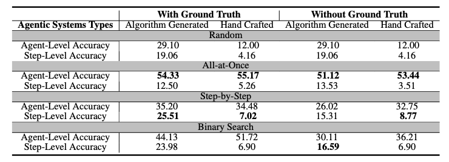

# Which Agent Causes Task Failures and When? On Automated Failure Attribution of LLM Multi-Agent Systems

## Overview

This repository is the implementation of "Which Agent Causes Task Failures and When? On Automated Failure Attribution of LLM Multi-Agent Systems". This version of the code is made to facilitate the peer review of the ICML 2025 submission of our paper. We plan to release the code accompanying the formal publication of this paper.



## Requirements

To install requirements:

```
pip install -r requirements.txt
```

## Dataset Construction

### 1. Tasks

- [GAIA](https://huggingface.co/gaia-benchmark)

- [AssistantBench](https://assistantbench.github.io/) 

Who\&When utilizes queries from GAIA and AssistantBench to construct failure logs. Ensure that both GAIA and AssistantBench are downloaded in advance. Then, set up the dataset following the settings provided in the paper.

### 2. Algorithm-generated multi-agent systems
Specify the dataset name (e.g. GAIA or assistant_bench) and path to your data in the code beforehand.

```
cd /Dataset_Construction/alg-generated
python main.py
```

### 3. Hand-crafted multi-agent systems

We utilize Magnetic-One[1] in autogen library[2] to construct failure logs for hand-crafted multi-agent systems. The generation of these logs strictly adheres to the official documentation provided below.

- GAIA: https://github.com/microsoft/autogen/tree/main/python/packages/agbench/benchmarks/GAIA 

- AssistantBench: https://github.com/microsoft/autogen/tree/main/python/packages/agbench/benchmarks/AssistantBench 

### 4. Annotation Guideline

We follow the following guide to annotate these failure logs.



The constructed data could be found in the folder named Who&When.

## Automated Failure Attribution

Please ensure that you specify 1. the path to your data and 2. data type (is_handcrafted or not) in the corresponding sections of the code before executing it.

- All-at-Once
    ```
    cd AutoFA/All-at-Once
    python eval.py >> eval.txt
    python acc.py
    ```

- Step-by-Step:
    ```
    cd AutoFA/Step-by-Step
    python eval.py >> eval.txt
    python acc.py
    ```

- Binary Search:
    ```
    cd AutoFA/Binary_Search
    python eval.py >> eval.txt
    python acc.py
    ```

## Experimental Results



More results could be found in the paper.

## Reference

*[1] Fourney, A., Bansal, G., Mozannar, H., Tan, C., Salinas, E., Niedtner, F., ... & Amershi, S. (2024). Magentic-one: A generalist multi-agent system for solving complex tasks. arXiv preprint arXiv:2411.04468.*

*[2] Wu, Q., Bansal, G., Zhang, J., Wu, Y., Zhang, S., Zhu, E., ... & Wang, C. (2023). Autogen: Enabling next-gen llm applications via multi-agent conversation framework. arXiv preprint arXiv:2308.08155.*


